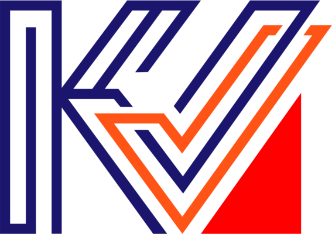
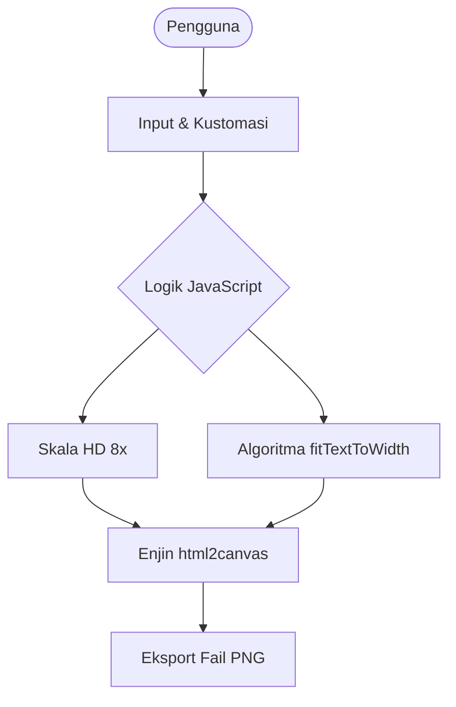

  
  <h1>LogoKV</h1>
  
Penjana Logo Kolej Vokasional Berkualiti Tinggi

  
<strong>Versi 1.1.0</strong>

---

## Seni Bina Utama (Architecture)

Aplikasi ini menggunakan pendekatan berpusatkan klien untuk memastikan prestasi yang pantas dan privasi data yang terjamin.

---

## Ciri-ciri Utama

- **Pratonton Masa Nyata**: Lihat setiap perubahan teks secara langsung pada skrin.
- **Eksport PNG HD**: Menghasilkan fail imej dengan ketajaman luar biasa (skala 8x) yang sesuai untuk tujuan percetakan dan pembentangan.
- **Penyesuaian Lanjutan**: Fleksibiliti untuk menukar tajuk, sub-tajuk, dan teks moto melalui panel Advanced.
- **Mod Latar Belakang**: Pilih antara mod putih, hitam, atau checkered untuk memastikan logo kelihatan sempurna pada sebarang latar.
- **Zum Interaktif**: Klik pada logo untuk melihat butiran halus dengan lebih dekat.

---

## Perincian Seni Bina (Technical Architecture)

Aplikasi ini dibangunkan dengan fokus kepada kecekapan pemprosesan di bahagian klien (client-side).

### 1. Lapisan Struktur (Structural Layer)
Menggunakan HTML5 Semantik untuk memastikan kebolehcapaian (accessibility) dan struktur dokumen yang bersih. Komponen utama dibahagikan kepada `preview-card` untuk visualisasi dan `panel-container` untuk interaksi pengguna.

### 2. Lapisan Penggayaan (Presentation Layer)
Dikuasakan oleh Vanilla CSS3 dengan pendekatan reka bentuk responsif. Penggunaan unit dinamik dan Flexbox memastikan aplikasi ini kelihatan premium pada pelbagai saiz peranti.

### 3. Lapisan Logik & Rendering (Logic & Rendering Layer)
- **Pengendalian DOM**: JavaScript (ES6+) menguruskan input pengguna dan mengemas kini elemen visual secara asinkronus.
- **Enjin Penyesuaian Teks**: Algoritma `fitTextToWidth` secara dinamik melaraskan saiz fon bagi memastikan teks sentiasa muat dalam ruang yang disediakan.
- **Pemprosesan Imej**: Integrasi `html2canvas` membolehkan penukaran elemen DOM kepada kanvas beresolusi tinggi sebelum dieksport.

---

## Teknologi yang Digunakan

| Komponen | Teknologi |
| :--- | :--- |
| **Bahasa Utama** | HTML5, CSS3, JavaScript (ES6+) |
| **Rendering** | [html2canvas](https://html2canvas.hertzen.com/) |
| **Tipografi** | Google Fonts (Roboto) & Custom KV Fonts |
| **Ikonografi** | SVG & Custom Icons |

---

## Cara Penggunaan

1. **Input Nama**: Masukkan nama Kolej Vokasional anda (contoh: "Kuala Lumpur").
2. **Kustomasi**: Aktifkan mod Advanced jika anda ingin menukar teks kementerian atau moto bawah.
3. **Semakan**: Tukar latar belakang untuk memastikan kontras logo adalah betul.
4. **Muat Turun**: Klik butang Save to device (HD). Fail akan disimpan secara automatik ke peranti anda.

---

## Pembangun

Projek ini direka dan dibangunkan oleh **aldr syfq** & [@AHF](https://github.com/AgentHitmanFaris). Sebarang maklum balas atau cadangan dialu-alukan melalui saluran YouTube rasmi.

---

> [!NOTE]
> Aplikasi ini dijalankan sepenuhnya dalam pelayar anda. Tiada data atau imej yang dimuat naik ke pelayan, memastikan privasi anda terpelihara sepenuhnya.
